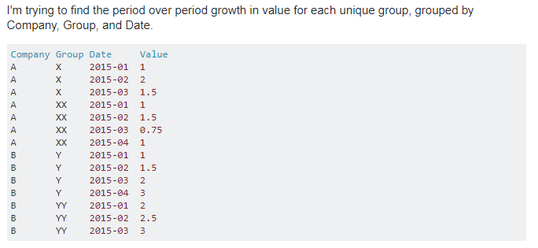
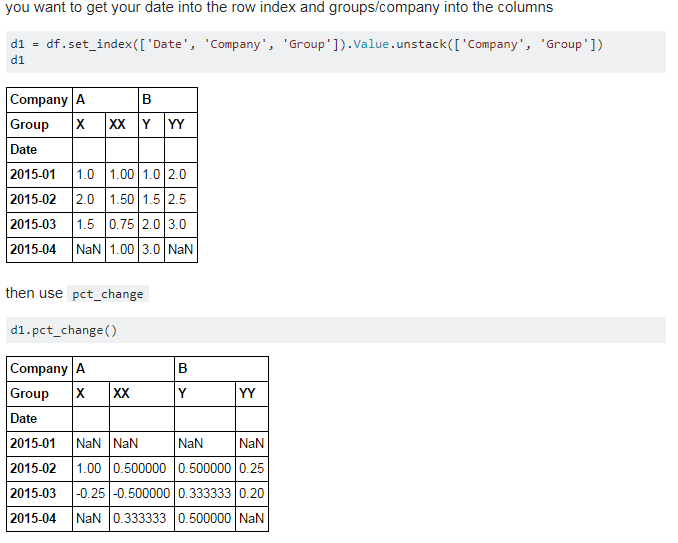
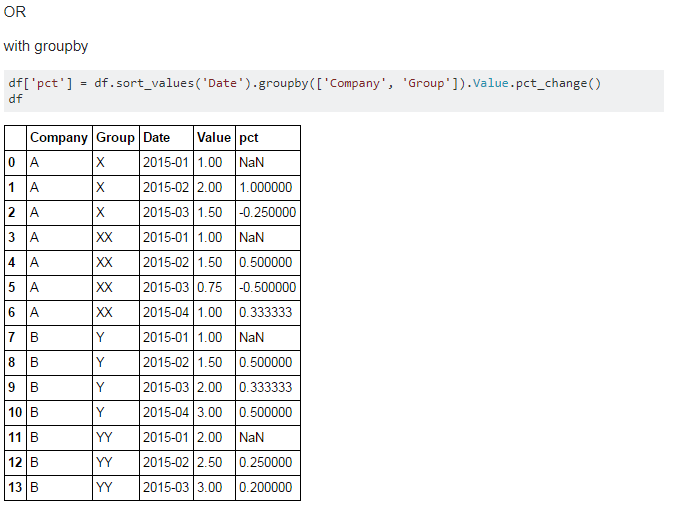

#  df数据框操作

## 环比变化/pct_change
* 环比变换只能针对数据运算，如果df数据框有非数字，会报错的；

### 环比计算(pct_change)——组内

#### 方法一

#### 方法二：

#### 参考网址
[pandas-groupby-with-pct-change](https://stackoverflow.com/questions/40273251/pandas-groupby-with-pct-change)
