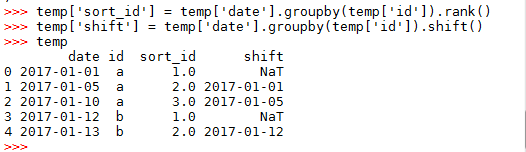
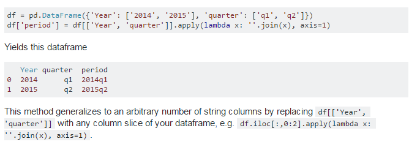

<!-- toc orderedList:0 depthFrom:1 depthTo:6 -->

* [pandas 原数据操作](#pandas-原数据操作)
  * [pandas 实现rownumer组内排序](#pandas-实现rownumer组内排序)
  * [pandas 重命名列](#pandas-重命名列)
  * [pandas DataFrame & Series 遍历数据(loop iterate on data)](#pandas-dataframe-series-遍历数据loop-iterate-on-data)
  * [遍历方法一：遍历列 df.iteritems():](#遍历方法一遍历列-dfiteritems)
    * [遍历所有数据 range(len(df))](#遍历所有数据-rangelendf)
    * [遍历行  df.iterrows():](#遍历行-dfiterrows)
    * [遍历行 --df.itertuples():](#遍历行-dfitertuples)

<!-- tocstop -->

# pandas 原数据操作

## pandas 实现rownumer组内排序
```sql
import pandas as pd
date = pd.to_datetime(['2017-01-01','2017-01-05','2017-01-10','2017-01-12','2017-01-13'])
temp = pd.DataFrame({'id':['a','a','a','b','b'],'date':date})
temp['sort_id'] = temp['date'].groupby(temp['id']).rank()
temp['shift'] = temp['date'].groupby(temp['id']).shift()
temp
```


## pandas 重命名列

```python
df = pd.DataFrame({'$a':[1,2], '$b': [10,20]})
-- 方法一
df.columns = ['a', 'b']
-- 方法二
df.rename(columns={'$a': 'a', '$b': 'b'}, inplace=True)
```

## pandas DataFrame & Series 遍历数据(loop iterate on data)
```python
#数据集
import pandas as pd
import numpy as np
dates = pd.date_range("20150101",periods=3)
df = pd.DataFrame(np.random.randn(3,4),index = dates,columns=['A','B','C','D'])
df
>>> df
               A         B         C         D
2015-01-01 -0.961204  0.175260  0.501385  0.056622
2015-01-02  0.404484  0.380673 -1.535502  0.968682
2015-01-03  0.227220  0.245580 -1.573848 -0.727980
>>>
```
## 遍历方法一：遍历列 df.iteritems():
DataFrame.iteritems()    :Iterator over (column name, Series) pairs.
``` python
>>> for colName,colSeries in df.iteritems():
...     print(colName)
...     print(colSeries)
...     print('----------------------------')
...
A
2015-01-01   -0.961204
2015-01-02    0.404484
2015-01-03    0.227220
Freq: D, Name: A, dtype: float64
----------------------------
B
2015-01-01    0.175260
2015-01-02    0.380673
2015-01-03    0.245580
Freq: D, Name: B, dtype: float64
----------------------------
C
2015-01-01    0.501385
2015-01-02   -1.535502
2015-01-03   -1.573848
Freq: D, Name: C, dtype: float64
----------------------------
D
2015-01-01    0.056622
2015-01-02    0.968682
2015-01-03   -0.727980
Freq: D, Name: D, dtype: float64
----------------------------

```
### 遍历所有数据 range(len(df))
``` python
#获取行号
for row in  range(len(df)):
    print(row)
    a = df.ix[row,'A']
    a
```

### 遍历行  df.iterrows():
DataFrame.iterrows()    :Iterate over the rows of a DataFrame as (index, Series) pairs. 数据一致是对列来说的，所以此方法迭代时数据类型会改变，如果想使用原始数据类型，最好使用itertuples，且速度快于Itetuples.

```python
>>> for index,rowSeries in df.iterrows():
...     print(index)
...     print(rowSeries)
...     print('----------------------------')
...
2015-01-01 00:00:00
A   -0.961204
B    0.175260
C    0.501385
D    0.056622
Name: 2015-01-01 00:00:00, dtype: float64
----------------------------
2015-01-02 00:00:00
A    0.404484
B    0.380673
C   -1.535502
D    0.968682
Name: 2015-01-02 00:00:00, dtype: float64
----------------------------
2015-01-03 00:00:00
A    0.227220
B    0.245580
C   -1.573848
D   -0.727980
Name: 2015-01-03 00:00:00, dtype: float64
----------------------------
>>>
```
### 遍历行 --df.itertuples():
DataFrame.itertuples(index=True)    :Iterate over the rows of DataFrame as tuples, with index value as first element of the tuple.
```python
>>> for rowTuple in df.itertuples():
...     print(rowTuple[0])
...     print(rowTuple[1:])
...
2015-01-01 00:00:00
(-0.96120433903969726, 0.17526022014567602, 0.50138454704996849, 0.056621913828979742)
2015-01-02 00:00:00
(0.40448350499023422, 0.38067257835926094, -1.5355017359973453, 0.96868231483007206)
2015-01-03 00:00:00
(0.22721956422657677, 0.24557994571203715, -1.5738481030018934, -0.72798003142334688)
>>>
```
##　pandas 将两列文本转换成一行文本
Combine two columns of text in dataframe in pandas/python
```python
df = pd.DataFrame({'Year': ['2014', '2015'], 'quarter': ['q1', 'q2']})
df['period'] = df[['Year', 'quarter']].apply(lambda x: ''.join(x), axis=1)
```

参考教程：[combine-two-columns-of-text-in-dataframe-in-pandas-python](http://stackoverflow.com/questions/19377969/combine-two-columns-of-text-in-dataframe-in-pandas-python)
